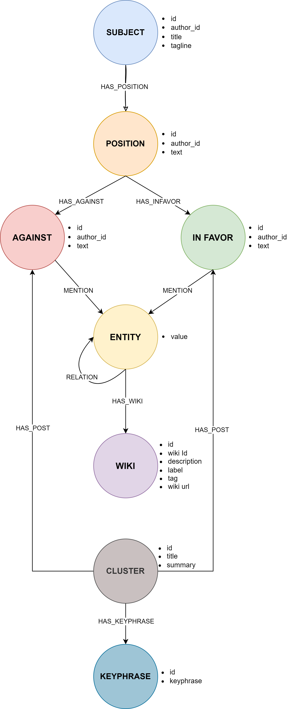

# EU_ORBIS

This repository contains the implementation of EU project: ORBIS

**Abstract:** ORBIS addresses the disconnects between ambitious ideas and collective actions at a large socio-technical scale. It responds to the profound lack of dialogue between citizenship and policy making institutions by providing a theoretically sound and highly pragmatic socio-technical solution to enable the transition to a more inclusive, transparent and trustful Deliberative Democracy in Europe. The project shapes and supports new democratic models that are developed through deliberative democracy processes; it follows a socioconstructive approach in which deliberative democracy is not a theory which prescribes new democratic practices and models, but rather the process through which we can collectively imagine and realize them. ORBIS provides new ways to understand and facilitate the emergence of new participatory democracy models, together with the mechanisms to scale them up and consolidate them at institutional level. It delivers: (i) a sound methodology for deliberative participation and co-creation at scale; (ii) novel AI-enhanced tools for deliberative participation across diverse settings; (iii) a novel socio-technical approach that augments the articulation between deliberative processes and representative institutions in liberal democracies; (iv) new evidence-based democratic models that emerge from the application of citizen deliberation processes; (v) demonstrated measurable impact of such innovations in real-world settings. The project builds on cutting-edge AI tools and technologies to develop a sustainable digital solution, and bridges theories and technological solutions from the fields of political and social science, social innovation, Artificial Intelligence, argumentation and digital democracy. The achievement of the project’s goal is validated through six use cases addressing contemporary issues at different scales and settings, experimenting with different civic participation and deliberation models, and involving diverse types of stakeholders.

## Table of Contents
- [EU\_ORBIS](#eu_orbis)
  - [Table of Contents](#table-of-contents)
  - [Summary](#summary)
  - [How to run](#how-to-run)
  - [Data](#data)
  - [Clustering](#clustering)
  - [Ontology and Knowledge Graph Construction](#ontology-and-knowledge-graph-construction)
  - [Contact](#contact)

## Summary

Keywords:
- Democratic engagement and civic participation
- New participatory democracy models

Project number: 101094765

Project name: Augmenting participation, co-creation, trust and transparency in Deliberative Democracy at all scales

Project acronym: ORBIS

Call: HORIZON-CL2-2022-DEMOCRACY-01

Topic: HORIZON-CL2-2022-DEMOCRACY-01-02

Type of action: HORIZON Research and Innovation Actions

Granting authority: European Research Executive Agency

Grant managed through EU Funding & Tenders Portal: Yes (eGrants)

Project starting date: fixed date: 1 February 2023

Project end date: 31 January 2026

Project duration: 36 months

## How to run
--- 
1. Clone a virtual environment 
```
    python3 -m  venv .env
```

2. Activate the virtual environment 
```
    source .env/bin/activate
```
3. Install requirements
```
    pip3 install -r requirements.txt
```

Download and install the `en_core_web_sm` model for spaCy:
```
    python3 -m spacy download en_core_web_sm
```

Install `LMRank` directly from source
```
pip3 install git+https://github.com/NC0DER/LMRank/
```

4. Run
```
    python3 0_download_bcause.py  # Downloads data from BCAUSE API
    python3 1_clustering.py       # Perfom clustering in data
    python3 2_text2KG.py          # Creates a KG from the user comments
```

Alternatively, you can run all the scripts sequentially with:
```
    sh bash.sh
```

**Note**: Before running the scripts, ensure that the **OpenAI API key** and **Neo4j credentials** are defined in the `config.yaml` file, as these are necessary for the clusterng pipeline and generating the Knowledge Graph.

## Data
This repository contains the implementation of ORBIS Project in **BCAUSE** dataset.
The dataset consists of user posts categorized into three categories: 
- **Positions:** The main stances or topics of discussion. 
- **Arguments in Favor:** Supporting arguments for each position. 
- **Arguments Against:** Counterarguments to each position.

## Clustering
Clustering is conducted on both In Favor and Against Statements for each Position, as illustrated in the diagram below:


In detail:
1. **Clustering**: KMeans algorithm is applied to cluster both "In Favor" and "Against" statements for each position.
2. **Summarization**: Each cluster is summarized using a combination of extractive and abstractive methods.
3. **Keyphrases**: The top 5 keyphrases are identified for each cluster using the [LMRank](https://ieeexplore.ieee.org/document/10179894) algorithm.
4. **Titles**: A concise title is generated for each cluster using the GPT model.

## Ontology and Knowledge Graph Construction

Post-clustering, the `text2KG` script constructs a Knowledge Graph based on the following ontology:



<br><br><br><br>

An extra step, **Semantic Enrichment** of KG was also implemented. Specifically, an **Entity Linking System** was used, which links entity mentions in nodes of KG to their corresponding entities in Wikipedia. The process is illustrated in the diagram below:


## Contact
Ioannis Eftsathiou (efstathiou@novelcore.eu)